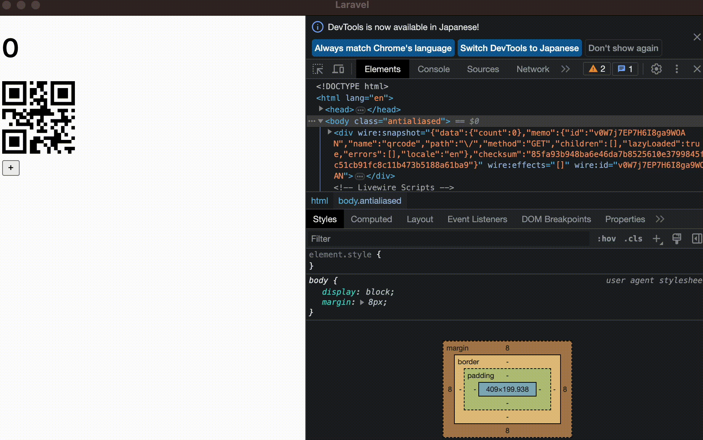

QR Code Generator Example with [NativePHP](https://nativephp.com/) + [Laravel Volt](https://livewire.laravel.com/docs/volt)

QR Code generated by [simple-qrcode](https://github.com/SimpleSoftwareIO/simple-qrcode)


# usage

```sh
php artisan native:serve
```

# dev

```sh
npm i 
npm run dev

php artisan native:serve
```

# screenshot

